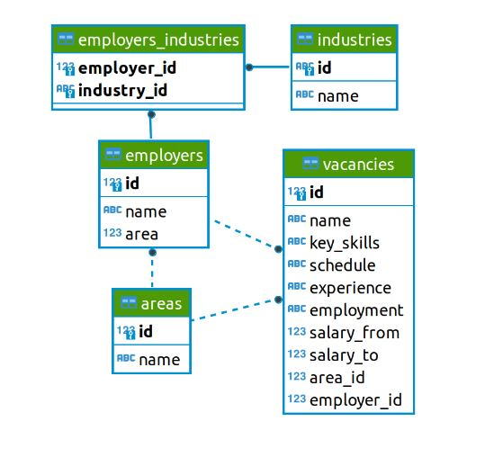
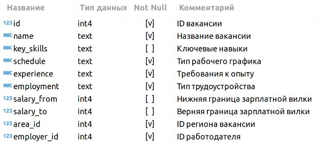

# <center> Анализ вакансий из HeadHunter

## Оглавление
1. [Описание проекта](#Описание-проекта)
2. [Описание данных](#Описание-данных)
3. [Зависимости](#Используемые-зависимости)
4. [Установка проекта](#Установка-проекта)
5. [Использование проекта](#Использование)
6. [Авторы](#Авторы)
7. [Выводы](#выводы)

## Описание проекта

Имеется база вакансий с сайта _hh.ru_, хранящаяся в базе данных `project_sql`.

**Проблема** в том, что необходимо понять, что из себя представляют данные и насколько они соответствуют целям проекта при создании модели машинного обучения. В литературе эта часть работы над ML-проектом называется Data Understanding, или анализ данных.

**Данный проект** направлен на анализ данных и включает в себя:

* знакомство с данными
* предварительный анализ данных
* детальный анализ вакансий
* предметный анализ

**О структуре проекта:**
* [img](./img) - папка с изображениями из описания проекта
* [plotly](./plotly) - папка с графиками, для возможности их просмотра в браузере 
* [Project_2_notebook.ipynb](./Project_2_notebook.ipynb) - jupyter-ноутбук, содержащий основной код проекта, в котором представлена вся работа над данными
* [requirements.txt](./requirements.txt) - файл с версиями используемых модулей, для воспроизводимости кода


## Описание данных
В этом проекте используются данные с сайта _hh.ru_, загруженные в БД `project_sql`.

### <center> Структура данных


Более подробно:
* *VACANCIES*
  * Таблица хранит в себе данные по вакансиям и содержит следующие столбцы:
  
  >Зарплатная вилка — это верхняя и нижняя граница оплаты труда в рублях (зарплаты в других валютах уже переведены в рубли). Соискателям она показывает, в каком диапазоне компания готова платить сотруднику на этой должности.

* **AREAS**
  * Таблица-справочник, которая хранит код города и его название.
  

* **EMPLOYERS**
  * Таблица-справочник со списком работодателей.
  

* **INDUSTRIES**
  * Таблица-справочник вариантов сфер деятельности работодателей.
  

* **EMPLOYERS_INDUSTRIES**
  * Дополнительная таблица, которая существует для организации связи между работодателями и сферами их деятельности.
  Эта таблица нужна нам, поскольку у одного работодателя может быть несколько сфер деятельности (или работодатели могут вовсе не указать их). Для удобства анализа необходимо хранить запись по каждой сфере каждого работодателя в отдельной строке таблицы.
  
## Используемые зависимости
* Python (3.11.1):
    * [pandas (1.5.3)](https://pandas.pydata.org)
    * [psycopg2 (2.9.6)](https://www.psycopg.org)
    * [requests (2.28.2)](https://seaborn.pydata.org)
    * [beautifulsoup4 (4.12.0)](https://www.crummy.com/software/BeautifulSoup/)
    * [plotly (5.13.0)](https://plotly.com/python/)

## Установка проекта

* ```
    git clone https://github.com/SkillfactoryDS/DataCleaningProject
    ```
* Открыть директорию  `project_2/`  
                             

## Использование
Вся информация о работе представлена в jupyter-ноутбуке Project_2_notebook.ipynb.
Если не отображаются графики на GitHub - можно открыть их в браузере, они находятся в папке `plotly/`

## Авторы

* [Егор Орлов](https://vk.com/liquidlogic)

## Выводы

По итогу исследования данных выявили зависимости в данных, распределения количества вакансий от таких показателей, как опыт работы, занятость, рабочий график(оказалось, что более всего требуются специалисты с небольшим опытом работы(скорее всего молодые - для успешного обучения и продвижения компании засчет молодых амбициозных работников),на полную занятость(может быть связано с большей эффективностью работу непосредственно в офисе или с необходимостью работы на каком-либо объекте в течение дня)).Так же установленно, что компания "Яндекс" предоставляет рабочие места в наибольшем объёме по сравнению с рстальными компаниями, а также в самом большом количестве регионов(это может быть связано с тем, что "Яндекс" - крупнейшая технологическая компания в России и ведущая в Европе, следовательно им нужно много работников в различных районах нашей(и не только) страны). И важное наблюдение - более половины работодателей не указывают зарплату при размещении вакансии, что является помехой для работы рекомендательной системы _hh.ru_, следовательно данные нуждаются в заполнении с учетом взаимосвязей других признаков(например в зависимости от региона, занятости, рабочего графика и др.).