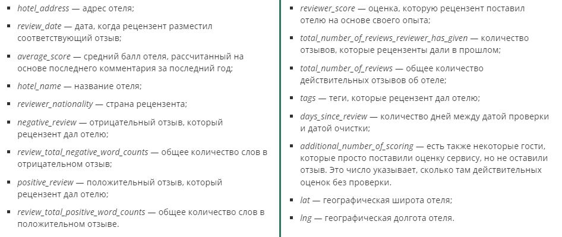

# <center> PROJECT-3. EDA + Feature Engineering

## Оглавление
1. [Описание проекта](#Описание-проекта)
2. [Описание данных](#Описание-данных)
3. [Зависимости](#Используемые-зависимости)
4. [Установка проекта](#Установка-проекта)
5. [Использование проекта](#Использование)
6. [Авторы](#Авторы)
7. [Выводы](#выводы)

## Описание проекта

Имеется датасет, в котором содержатся сведения о 515 000 отзывов на отели Европы.

**Проблема** - это нечестные отели, которые накручивают себе рейтинг. Одним из способов обнаружения таких отелей является построение модели, которая предсказывает рейтинг отеля. Если предсказания модели сильно отличаются от фактического результата, то, возможно, отель ведёт себя нечестно, и его стоит проверить.

**Данный проект** направлен построение такой моделии включает в себя:

* знакомство с данными
* очистку данных
* проектирование признаков
* преобразование признаков
* отбор признаков
* построение модели
* проведение нескольких экспериментов для получения лучшей метрики

**О структуре проекта:**
* [art](./art) - папка с изображениями из описания проекта
* [project_EDA.ipynb](./project_EDA.ipynb) - jupyter-ноутбук, содержащий основной код проекта
* [requirements.txt](./requirements.txt) - файл с версиями используемых модулей, для воспроизводимости кода


## Описание данных
В этом проекте используются данные с сайта _Booking_, описывающие отели по отзывам посетителей.

### <center> Структура датасета



## Используемые зависимости
* Python (3.11.1):
    * [pandas (2.0.1)](https://pandas.pydata.org)
    * [numpy (1.24.3)](https://numpy.org)
    * [requests (2.30.0)](https://seaborn.pydata.org)
    * [beautifulsoup4 (4.12.2)](https://www.crummy.com/software/BeautifulSoup/)
    * [SciPy (1.10.1)](https://scipy.org)
    * [GeoPy (2.3.0)](https://github.com/geopy/geopy)
    * [Category Encoders (2.6.0)](http://contrib.scikit-learn.org/category_encoders/)
    * [scikit-learn (1.2.2)](https://scikit-learn.org/stable/)
    * [Comet ML (3.33.4)](https://comet.com/)

## Установка проекта

* ```
    git clone https://github.com/StartrexII/DataScienceProjects
    ```
* Открыть директорию  `project_3/`  
                             

## Использование
Вся информация о работе представлена в jupyter-ноутбуке project_EDA.ipynb.
Для запуска кода необходимо скачать исходный датасет (сделать это можно [здесь](https://drive.google.com/file/d/1Qj0iYEbD64eVAaaBylJeIi3qvMzxf2C_/view 'Google Drive link')) и установить его в папку `data/`.

## Авторы

* [Егор Орлов](https://vk.com/liquidlogic)

## Выводы

От первичного анализа данных до обучения модели предстоит проделать большой объем работы для получения качественной модели, а также далее провести немало экспериментов для получения наилучшего результата.